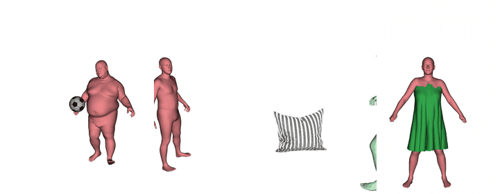
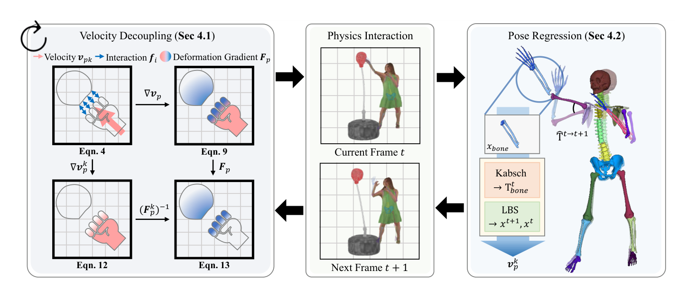

# PIAvatar: Physically Interactive Avatars via Deformation Gradient Decoupling

This repository contains the code of PIAvatar, an MPM-based simulator for physically interactive human avatars.

<a href="https://scholar.google.com/citations?hl=en&user=SmDm3HoAAAAJ">Sang-Hun Han</a>,
<a href="https://scholar.google.com/citations?user=VUj1ZWoAAAAJ">Min-Gyu Park</a>,
<a href="https://jsshin.com/">Jisu Shin</a>,
<a href="https://www.seunghyunshin.com/">Seunghyun Shin</a>,
<a href="https://www.jinhwipark.com/">Jin-Hwi Park</a>, and
<a href="https://sites.google.com/site/hgjeoncv">Hae-Gon Jeon</a>
<br>Accepted to <a href="https://eccv2026.ecva.net/">ECCV 2026</a>

<a href="https://arxiv.org/abs/2606.21162">Paper</a> |
<a href="https://sanghunhan92.github.io/conference/PIAvatar/">Project Page</a>

<p align="center"></p>

---

## Method

<p align="center"></p>

PIAvatar builds on two components (Sec. 4 of the [paper](https://arxiv.org/abs/2606.21162)):

- **Kinematic deformation gradient decoupling** — the user-defined kinematic velocity is excluded from the deformation-gradient update (F ← F (F<sup>k</sup>)<sup>-1</sup>), so prescribed motion produces no restorative stress while external contacts still do.
- **Skeleton-based pose regression** — an embedded skeleton tracks the avatar's pose in closed form (Kabsch + LBS) even under non-rigid deformation, providing the kinematic velocity for the next frame.

## Installation

Tested on Ubuntu 20.04, RTX 4090 (driver 535 / CUDA 11.8), Python 3.11, PyTorch 2.1.2. An OptiX-capable GPU is required.

```bash
git clone https://github.com/SangHunHan92/PIAvatar.git
cd PIAvatar
bash setup_env.sh      # conda env "piavatar" + CUDA extensions + 3DGRUT renderer
conda activate piavatar
```

## Assets

Download [`piavatar_assets.tar.gz`](https://drive.google.com/file/d/1lne-a_8KgmWxA3vScRxJiqS4hm5l8sNI/view?usp=sharing) (≈550 MB) and extract it in the repository root:

```bash
pip install gdown
gdown 1lne-a_8KgmWxA3vScRxJiqS4hm5l8sNI
tar -xzf piavatar_assets.tar.gz
```

Sources, licenses, and credits for the bundled data are listed in [ASSETS.md](ASSETS.md).
The loose-garment demo additionally needs `a1_canonical_assets.npz` — see [ASSETS.md](ASSETS.md); all other demos run out of the box.

## Running the Demos

```bash
bash scripts/run_demos.sh          # all, or: main | stickiness | selfpen | soft | cloth
```

| Demo | Command |
|---|---|
| Main method (basic MPM vs. ours) | `python simulation.py --config configs/main_method/rucksack_walk.json [--method vanila]` |
| Avatar–avatar interaction | `python simulation.py --config configs/main_method/low_kick.json` (or `high_five.json`) |
| Stickiness / permanent deformation | `python simulation_separable_contact.py --config configs/stickiness/c_ours.json` (or `a_*`, `b_*`) |
| Self-penetration (multi-field contact) | `python simulation_lbs_decouple.py --config configs/self_penetration/b_multi_field.json` (or `a_*`) |
| Soft-tissue (belly jiggle) | `python simulation.py --config configs/soft_tissue/belly_jump.json` |
| Loose garment (thin-shell cloth) | `python simulation_with_cloth.py --config configs/cloth/spin_jump.json` |

Results are written to `output/<name>/` — `3dgrut/output.mp4` (ray-traced video), per-frame PNGs, `simulation_ply/`, and the exact config used.

## Citation

```bibtex
@inproceedings{han2026piavatar,
  title     = {PIAvatar: Physically Interactive Avatars via Deformation Gradient Decoupling},
  author    = {Han, Sang-Hun and Park, Min-Gyu and Shin, Jisu and Shin, Seunghyun and Park, Jin-Hwi and Jeon, Hae-Gon},
  booktitle = {Proceedings of the European Conference on Computer Vision (ECCV)},
  year      = {2026}
}
```

## License

The code is released under the [Creative Commons Attribution-NonCommercial 4.0 International](LICENSE.txt) license.

Built on [PhysGaussian](https://github.com/XPandora/PhysGaussian), [warp-mpm](https://github.com/zeshunzong/warp-mpm), [Animatable Gaussians](https://github.com/lizhe00/AnimatableGaussians), [3DGS](https://github.com/graphdeco-inria/gaussian-splatting), [3DGRUT](https://github.com/nv-tlabs/3dgrut), [OSSO](https://github.com/MarilynKeller/OSSO), [MPMAvatar](https://github.com/KAISTChangmin/MPMAvatar), and [SMPL-X](https://smpl-x.is.tue.mpg.de). Redistributed data remains under its original license — see [ASSETS.md](ASSETS.md).
